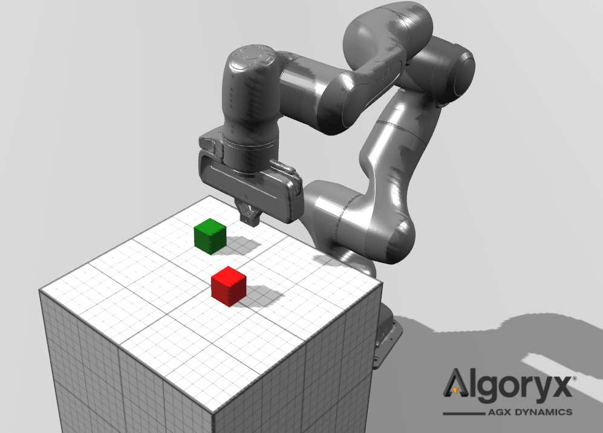

# AGX ROS2 collection
Collection of ROS2 packages that shows how you can use ROS2 together with AGX Dynamics.

## agx_tutorials
This packages collects tutorials for how to use ROS2 packages like ros2_control and moveIt together with AGX Dynamics, AGX Dynamics for Unity and AGX Dynamics for Unreal.

### Franka Emika Panda robot
Launch the tutorial with:

`ros2 launch agx_tutorials panda_demo_launch.py`

It will start the AGX Dynamics simulation of the a Panda robot together with MoveIt and ros2_control with the `JointTrajectoryController` for follow the trajectories planned using MoveIt. In this example the command interface
for the robot joint is position, meaning that the controller just forwards the positions to the robot joints. The
robot joints holds the assigned position using the [Lock1D](https://www.algoryx.se/documentation/complete/agx/tags/latest/doc/UserManual/source/constraints.html#lock1d) secondary constraint.

The same example exists using effort as command interface. Start the effort example using:

`ros2 launch agx_tutorials panda_demo_effort_launch.py`

The controller will now try to follow the planned trajectory position by setting efforts (torques) on the joints of the simulated robot. The error in the position is mapped to efforts through a PID-loop. The simulated robot is also gravity compensated using AGX Dynamics inverse dynamics module.

There is also an launch file to launch the ROS2 stack without the simulation running.

`ros2 launch agx_tutorials panda_demo_no_simulation_launch.py`

Then you must have launched AGX simulation somewhere else first. This can for example be useful when you have the simulation running in AGX Dynamics for Unity or AGX Dynamics for Unreal (examples for this is coming), or if you are on windows running the simulation natively in windows and the ros2 stack using WSL2.

#### Running 
To run the simulation on windows using the checkout this repository using and source your windows AGX installation.
When in the root of the repository (where this README.md is) run the .bat file `start_panda_simulation.bat position` to start the simulation with the position command interface or `start_panda_simulation.bat effort` to start the simulation with the effort command interface.

### More robots to come
...

### Note on connection between ros2_control and AGX Simulation
ros2_control controllers are speaking to the AGX Simulation using the ROS2 package [topic_based_ros2_control](https://github.com/PickNikRobotics/topic_based_ros2_control). The robot listens to `sensor_msgs/JointState` commands on the `agx_joint_commands` topic and sends the current joint states back on the `agx_joint_states` topic. This is currently asynchronous and sensitive to that the simulation runs in realtime. 
